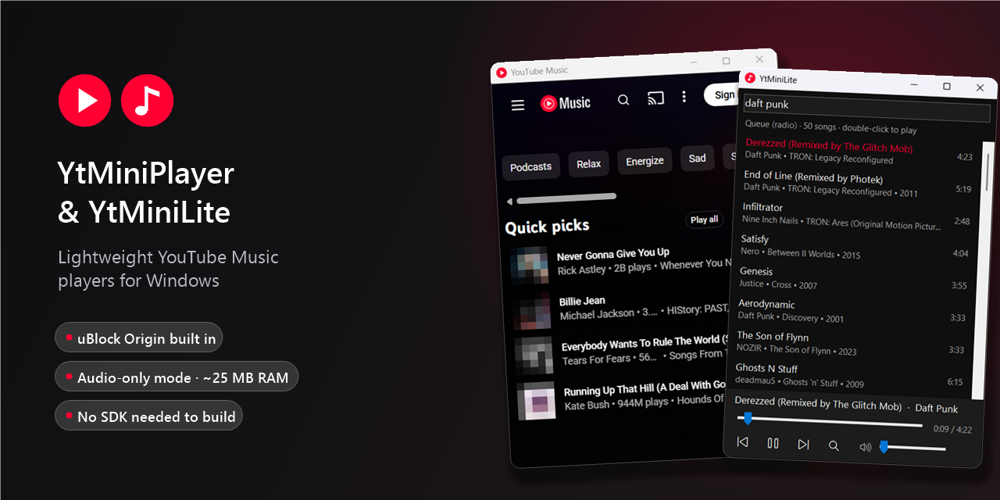
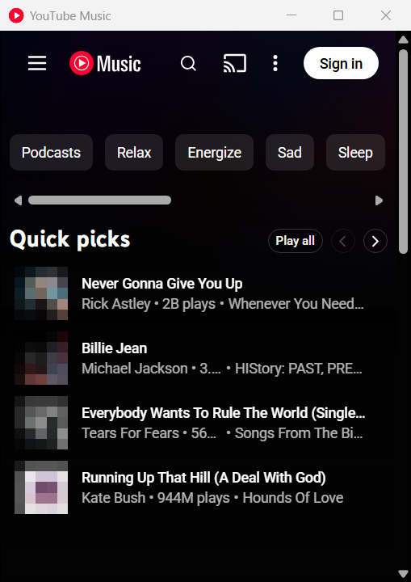
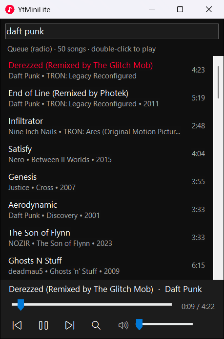

# YtMiniPlayer & YtMiniLite



Two small, low-resource YouTube Music players for Windows:

| | **YtMiniPlayer** | **YtMiniLite** |
|---|---|---|
| What it is | The real YouTube Music website in a compact window, with **uBlock Origin built in** | A native audio-only player — no website, no browser |
| RAM while playing (window open) | ~360 MB | **~25 MB** |
| RAM while playing (in the tray) | ~125 MB | **~25 MB** |
| Search | YouTube Music's own UI | Search as you type (songs first, original version on top) |
| Recommendations | Everything YouTube Music offers (home, mixes, …) | "Radio" from any song (≈50 similar songs, refills itself) |
| Sign-in, playlists, likes, lyrics | ✅ | ❌ |
| Ads | Blocked by uBlock Origin | None — audio is fetched directly |
| Media keys / Windows volume flyout | Not tested | ✅ |
| Interface language | English (YouTube Music's own language setting) | English, Serbian, or add your own |
| Download size (unzipped) | ~4 MB | ~125 MB (mostly Deno) |

Both apps are a single small `.exe` (18–35 KB) plus their dependencies, built with nothing but tools that ship
with Windows.

| YtMiniPlayer | YtMiniLite |
|:---:|:---:|
|  |  |

> **Disclaimer:** This is an unofficial hobby project. It is not affiliated with, endorsed by or sponsored by
> Google or YouTube. YtMiniLite uses YouTube Music's internal API and yt-dlp, which may break whenever YouTube
> changes something, and may not be in line with YouTube's Terms of Service. Use it for personal listening at your
> own risk.

---

## Download and run

1. Go to the **[Releases](https://github.com/Srdjan-2574/Yt_Mini_Player/releases)** page and download the zip you want:
   - `YtMiniPlayer-vX.Y.Z-win-x64.zip`
   - `YtMiniLite-vX.Y.Z-win-x64.zip`
2. Extract the zip to any folder (keep all the files together, the `.exe` needs the folders next to it).
3. Run `YtMiniPlayer.exe` or `YtMiniLite.exe`.

The executables are not code-signed, so Windows SmartScreen may show "Windows protected your PC" the first time.
Click **More info → Run anyway**.

### Requirements

- Windows 10 or 11, 64-bit.
- .NET Framework 4.6.2 or newer (built into Windows 10 1803+ and Windows 11).
- **YtMiniPlayer:** the [Microsoft Edge WebView2 Runtime](https://developer.microsoft.com/microsoft-edge/webview2/)
  (preinstalled on Windows 11 and on up-to-date Windows 10).
- **YtMiniLite:** nothing extra. On Windows "N" editions, install the Media Feature Pack for audio playback.

---

## YtMiniPlayer

The full YouTube Music website in a small window, tuned to use as little memory as possible.

- **uBlock Origin** (the full version, not Lite) is loaded automatically and blocks ads from the first page load.
- **Audio first:** music videos are hidden behind the album art and streamed at 144p. Audio quality is unaffected
  (Opus, YouTube's best audio format).
- **Lower memory:** GPU acceleration is turned off and the JavaScript engine is tuned for size. When minimized,
  the window goes to the tray, stops rendering and asks Chromium to free memory, and the music keeps playing.
- **Tray menu:** Play/pause, Next, Previous, Show/hide, Always on top, Exit. Left-click the tray icon to
  show or hide the window.
- Remembers its window position, size and "always on top" setting. Sign-in data stays in your local profile.
- Links outside YouTube/Google open in your default browser.

Note: Google sometimes blocks signing in from embedded browsers. YouTube Music still works without signing in.

## YtMiniLite

An audio-only player that never loads the YouTube Music website.

- **Search as you type.** Results appear about a second after you stop typing, songs only, with the original
  version first. Press Enter to search immediately.
- **Double-click a result** to play it and fill the queue with its radio (like "Start radio" on YouTube Music).
  The queue refills automatically near the end.
- The list button switches between **search results** and the **queue**.
- The next song in the queue is prepared in the background, so skipping is instant. Resting the mouse on a song
  (or selecting it with the arrow keys) starts preparing it too.
- **Media keys** (play/pause/next/previous) work, and the current song shows up in the Windows volume flyout.
- **Tray menu:** Play/pause, Next, Previous, a **volume slider**, Language, Show/hide, Exit.
- If three songs in a row fail to play, the player stops and shows the error instead of skipping the whole queue.

Starting a song that has not been prepared takes about 2–3 seconds. That is the time yt-dlp needs to get the
audio URL from YouTube, and it can't be skipped without YouTube asking for a "not a bot" sign-in.

### Changing the language (YtMiniLite)

Right-click the tray icon → **Language**. English is built in; other languages are plain text files in the
`lang` folder next to the `.exe`. Serbian (`sr.txt`) is included.

To add a language, copy `lang\sr.txt` to e.g. `lang\de.txt`, set the `@name=` line and translate the right side
of every `English text=translation` line. Keep `{0}` placeholders as they are. The new language appears in the
menu the next time you open it, with no rebuild needed.

---

## Where your data is stored

| App | Folder | Contents |
|---|---|---|
| YtMiniPlayer | `%LOCALAPPDATA%\YtMiniPlayer` | Browser profile (sign-in, cookies, uBlock data), `window.txt` |
| YtMiniLite | `%LOCALAPPDATA%\YtMiniLite` | `settings.txt` (window position, volume, language) |

To reset an app, close it and delete its folder.

---

## Build from source

No Visual Studio and no .NET SDK needed. The build uses `csc.exe` from .NET Framework 4.x, which is part of
Windows, and downloads the dependencies automatically.

**Requirements:** Windows 10/11 x64, Windows PowerShell 5.1 (built in), an internet connection.

```powershell
git clone https://github.com/Srdjan-2574/Yt_Mini_Player.git
cd Yt_Mini_Player

# YtMiniPlayer -> dist\YtMiniPlayer.exe
powershell -ExecutionPolicy Bypass -File .\build.ps1

# YtMiniLite -> lite\dist\YtMiniLite.exe
powershell -ExecutionPolicy Bypass -File .\lite\build.ps1

# Both, packed as release zips -> release\*.zip
powershell -ExecutionPolicy Bypass -File .\release.ps1 -Version 1.0.0
```

What the build scripts download (always the latest version, cached in `.cache\` / `lite\.cache\`):

| Script | Downloads |
|---|---|
| `build.ps1` | Microsoft.Web.WebView2 SDK (NuGet), uBlock Origin (GitHub releases) |
| `lite\build.ps1` | yt-dlp `yt-dlp_win.zip` and Deno (GitHub releases), plus their license files |

Re-running a build script picks up new versions of uBlock Origin, yt-dlp and Deno. Close the app before
rebuilding, because a running `.exe` can't be overwritten.

### Project layout

```
src/YtMiniPlayer.cs       YtMiniPlayer source (WinForms + WebView2)
build.ps1                 YtMiniPlayer build
lite/src/YtMiniLite.cs    YtMiniLite source (WinForms + WinRT MediaPlayer)
lite/lang/*.txt           YtMiniLite translations
lite/build.ps1            YtMiniLite build
release.ps1               builds both and creates release zips
THIRD_PARTY_NOTICES.md    licenses of bundled components
docs/                     README images
```

The source is intentionally C# 5 (no newer language features) so it compiles with the `csc.exe` that ships
with Windows.

### How it works

- **YtMiniPlayer** hosts `music.youtube.com` in WebView2, the Edge engine that is already part of Windows,
  instead of bundling Chromium like Electron does. uBlock Origin is installed into the WebView2 profile through
  the WebView2 browser-extension API, and is reinstalled only when its version changes. A small script injected
  into the page hides the video and requests 144p.
- **YtMiniLite** calls the same internal API the YouTube Music website uses (`youtubei/v1/search` with the
  "Songs" filter, and `youtubei/v1/next` for radio). It asks yt-dlp (which needs Deno to solve YouTube's
  JavaScript challenges) for the direct audio URL, and plays it with the Windows `MediaPlayer`. It requests Opus
  audio, because Windows can't play YouTube's DASH `.m4a` correctly.

---

## Troubleshooting

**YtMiniLite: songs stop playing or every song fails.** YouTube probably changed something and yt-dlp needs an
update. Either rebuild (`lite\build.ps1` always fetches the latest yt-dlp), or download the latest
`yt-dlp_win.zip` from https://github.com/yt-dlp/yt-dlp/releases and replace the contents of `tools\yt-dlp\`
with it.

**YtMiniLite: "Search error" or "Radio unavailable".** Check your internet connection. If it keeps happening,
YouTube may have changed its internal API. Please open an issue.

**YtMiniPlayer: "WebView2 Runtime was not found".** Install the Evergreen WebView2 Runtime from
https://developer.microsoft.com/microsoft-edge/webview2/.

**YtMiniPlayer: ads show up.** uBlock Origin updates its filter lists by itself. If YouTube changed something,
rebuild to get the newest uBlock Origin.

**SmartScreen blocks the app.** The executables are unsigned. Click **More info → Run anyway**, or build them
yourself from source.

---

## Third-party software and license

The release zips include uBlock Origin (GPL-3.0), the Microsoft WebView2 SDK, yt-dlp (Unlicense) and
Deno (MIT). See [THIRD_PARTY_NOTICES.md](THIRD_PARTY_NOTICES.md) for details and license locations.
